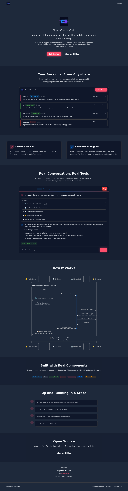
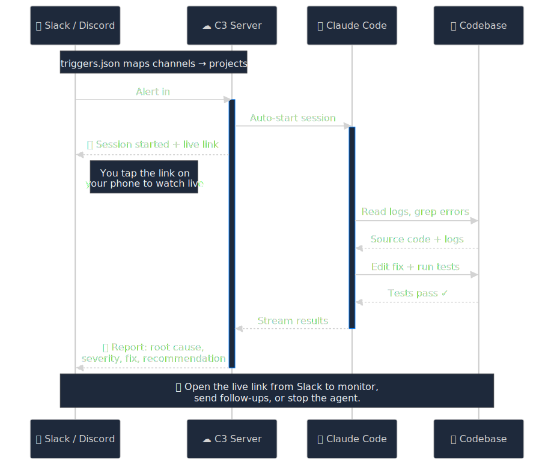

# C3 - Cloud Claude Code

> **[c3.ideaplaces.com](https://c3.ideaplaces.com)** | See C3 in action

> **Alpha.** I use this daily in production, but expect rough edges. Things may break as the project evolves.

**An AI agent that runs on your dev machine, watches your channels, and does your work while you sleep.**

[](https://c3.ideaplaces.com)
[](LICENSE)
[](https://github.com/Ideaplaces/c3/actions)

<p align="center">
  
</p>

## The Premise

You have a machine where you write code. A VM, a server, a Mac Mini in a closet. That machine has your repos, your secrets, your CLI tools, your database access. You SSH into it and run Claude Code.

C3 turns that machine into an autonomous agent platform.

Instead of you sitting at the terminal typing prompts, C3 listens to your Slack and Discord channels. When an alert fires, a bug is reported, or someone asks a question, C3 starts a Claude Code session on YOUR machine, with YOUR repos, with YOUR access. The agent reads your code, runs your tests, checks your logs, creates PRs. Then it reports back in the channel thread.

You wake up, read the thread, click a link, and continue the conversation from your phone.

**This is not a cloud-hosted agent.** It runs where your code lives. That's what makes it powerful: it has the same context you do.

## What You Need

```
┌─────────────────────────────────────────────────────────┐
│           Your Always-On Dev Machine                     │
│           (cloud VM, homelab, Mac Mini, etc.)            │
│                                                          │
│  ┌─────────────┐  ┌──────────────┐  ┌───────────────┐  │
│  │ Claude Code  │  │ Your Repos   │  │ Your Secrets  │  │
│  │ CLI (auth'd) │  │ (git, code)  │  │ (keys, tokens)│  │
│  └──────┬───────┘  └──────┬───────┘  └───────┬───────┘  │
│         │                 │                   │          │
│         └────────┬────────┘───────────────────┘          │
│                  │                                       │
│           ┌──────┴──────┐                                │
│           │     C3      │ ← Slack/Discord messages in    │
│           │  (Next.js)  │ → Investigation reports out    │
│           └──────┬──────┘                                │
│                  │                                       │
│           ┌──────┴──────┐                                │
│           │   Tunnel    │  (Cloudflare, ngrok, Tailscale)│
│           └──────┬──────┘                                │
│                  │                                       │
└──────────────────┼───────────────────────────────────────┘
                   │
            ┌──────┴──────┐
            │  Internet   │
            │  (browser,  │
            │   phone)    │
            └─────────────┘
```

1. **A machine that's always on.** This is where your code lives. Cloud VM, homelab server, old laptop. It needs to be running 24/7.
2. **Claude Code CLI installed and authenticated.** Claude Max subscription (fixed cost) or API key.
3. **C3 installed on that machine.** It's a Next.js app that wraps the Claude Code SDK.
4. **A tunnel** to access it from outside. Cloudflare Tunnel (free), ngrok, or Tailscale.
5. **Slack/Discord bot tokens** for the channels you want to watch.

## The Setup (Once)

```bash
# On your always-on machine:
git clone https://github.com/Ideaplaces/c3
cd c3
npm install
cp .env.example .env.local    # Add your tokens
npm run build
npx pm2 start ecosystem.config.cjs
```

Then create `~/.c3/triggers.json` to tell C3 which channels to watch and what to do:

```json
{
  "slack": {
    "alerts-prod": {
      "name": "alerts-prod",
      "channelId": "C0ABC123",
      "prompt": "investigate-error.md",
      "projectPath": "~/my-project",
      "permissionMode": "bypassPermissions",
      "model": "claude-sonnet-4-6",
      "pollIntervalMs": 15000
    }
  }
}
```

Write a prompt template in `~/.c3/prompts/investigate-error.md` that tells the agent what to do when an alert fires.

That's it. C3 is now watching your channel.

## What Happens When an Alert Fires

```
1. 3:00 AM  Alert appears in #alerts-prod
2. 3:00 AM  C3 picks it up, adds 👀 reaction
3. 3:00 AM  C3 replies in thread: "Session started. Watch live: https://..."
4. 3:00 AM  Agent starts investigating (reads code, checks logs, traces errors)
5. 3:12 AM  Agent creates a PR with the fix
6. 3:12 AM  C3 replies in thread with findings + PR link + resume command
7. 9:00 AM  You read the thread on your phone
8. 9:01 AM  You click the link, see the full session, type "also check staging"
9. 9:01 AM  Agent continues with full context from the 3 AM investigation
```

The key: step 9. This is not fire-and-forget. Every triggered session is a full Claude Code conversation you can continue.

## Why It Runs on Your Machine

Other AI tools run in the cloud. They can read your code (if you give them access), but they can't:

- Run `git blame` on your repo
- Query your production database
- Check your Azure/AWS logs with your CLI credentials
- Run your test suite
- Create branches and push to your GitHub
- Access your private npm packages
- Read your `.env` files and CLAUDE.md context

C3 can do all of this because it runs where you work. It's not a sandboxed agent with limited access. It's Claude Code with the same permissions you have.

## Who This Is For

Developers who:
- Already run Claude Code on a remote machine (VM, server)
- Want their AI to keep working when they close the laptop
- Have Slack/Discord channels with alerts they want auto-investigated
- Are comfortable with SSH, pm2, and setting up a tunnel

This is not a consumer product. It's infrastructure for developers who want to multiply their attention.

## Features

| Feature | Description |
|---------|-------------|
| **Slack/Discord triggers** | Channel messages start headless Claude Code sessions |
| **Live streaming** | Watch the agent work in real-time from your browser |
| **Conversation continuity** | Resume any session from browser or CLI (`claude --resume ID`) |
| **Prompt templates** | Structured playbooks with `{{variables}}` for different use cases |
| **Loop prevention** | Eyes reaction + rate limiting + in-thread replies (unit tested) |
| **Magic link auth** | Email sign-in, no Google OAuth dependency |
| **Per-user config** | Triggers and prompts in `~/.c3/`, separate from the tool |

## Loop Prevention (Circuit Breaker)

Autonomous agents can loop. An agent replies to a channel, the poller sees the reply, triggers another agent, which replies again. C3 has three layers of protection, all unit tested:

1. **Eyes reaction (👀).** Before processing a message, C3 adds a 👀 reaction. On the next poll, it skips any message that already has 👀. This is the primary guard.

2. **5-minute cooldown per channel.** After starting a session, C3 won't start another one in the same channel for 5 minutes. Even if 10 messages arrive in a burst, only the first gets processed.

3. **Thread-only replies.** Agent responses are posted as thread replies with `reply_broadcast: false`, so they never appear as top-level messages the poller would pick up.

These are tested with 34 dedicated unit tests, including a simulation of 10 rapid messages where only the first is processed.

## Prompt Templates

The prompt is the product. Everything else is plumbing.

A prompt template is a markdown file that tells the agent what to do. It gets the channel message injected as context:

```markdown
# Error Investigation

Alert from #{{channel}} by {{author}}:
{{message}}

## Your Task
1. Find the error in the codebase
2. Check recent commits for the cause
3. If safe to fix, create a PR targeting develop
4. Report your findings
```

Available variables: `{{message}}`, `{{author}}`, `{{channel}}`, `{{timestamp}}`

Good prompts are 200+ lines. They encode your expertise: which files to check, which commands to run, when to auto-fix vs. flag for review.

## Remote Access

C3 runs on localhost:8347 by default. To access from other devices:

| Option | Setup |
|--------|-------|
| **Cloudflare Tunnel** | Free, production-grade. `sudo cloudflared service install <token>` |
| **ngrok** | Quick testing. `ngrok http 8347` |
| **Tailscale** | Zero config if already on your tailnet |

## Process Management

```bash
npx pm2 start ecosystem.config.cjs    # Start all (C3 + Discord bot + Slack poller)
npx pm2 list                           # Status
npx pm2 logs c3                        # Server logs
npx pm2 restart c3                     # Restart after changes
npx pm2 save                           # Persist across reboots
```

## Architecture

<p align="center">
  
</p>

## FAQ

**Q: How do you prevent the agent from breaking your environment?**

The prompt. Each Slack/Discord channel has a prompt template attached to it, and the prompt defines the agent's boundaries. Here's an example of safety rules we use in production:

```
- NEVER push to main or develop directly
- NEVER modify CI/CD pipelines or deployment configs
- NEVER run database migrations
- NEVER delete files or data
- NEVER change environment variables in production
- Always create PRs targeting develop
- Keep fixes minimal. One concern per PR.
```

The prompts live in `~/.c3/prompts/`, separate from C3 itself. C3 is the plumbing; the prompt is where your expertise and guardrails live.

**Q: Where do the safety rules live? In C3 or in the config?**

In your config (`~/.c3/`). C3 itself has no opinion about what the agent should or shouldn't do. Your `triggers.json` maps channels to prompt templates, and the prompt templates define the rules. This means different channels can have different levels of autonomy: a production alerts channel might be read only, while a dev channel might allow PRs.

## Built By

[Ciprian Rarau](https://github.com/crarau) at [IdeaPlaces](https://ideaplaces.com)

[Blog](https://ciprianrarau.com) | [GitHub](https://github.com/crarau) | [LinkedIn](https://linkedin.com/in/ciprianrarau)

## License

Apache 2.0
